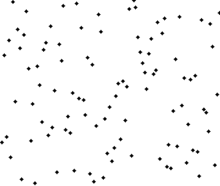

<center><h1> Trabalho Prático de Matemática Discreta: Análise de Algoritmos de Ordenação </h1> </center>


| Membros | Nome                     |
|---------|--------------------------|
| 01      | Juan Manoel              |
| 02      | Robin Hoodix             |
| 03      | Yang Jin Samara cavalari |
| 04      | Gustavo Jeromine         |
| 05      | Vladimir da Silva Borges |

### 1 - Introdução

Deve conter:
* Uma breve descrição do objetivo do trabalho
* O que são algoritmos de ordenação, o que fazem, como funcionam, onde podem ser aplicados, importância etc
* Uma breve introdução aos algoritmos escolhidos


```python
from IPython.display import HTML
import time
```

### 2 - Descrição e Análise do Algoritmo 1

Deve conter:
* Descrição completa do primeiro algoritmo escolhido: nome, origem, estratégia usada, e como funciona
* Estrutura do algoritmo em pseudocódigo
* Citações para a descrição do algoritmo e pseudocódigo


##### Descrição completa do primeiro algoritmo escolhido: nome, origem, estratégia usada, e como funciona
<br>
<b>Nome: </b> Merge Sort
<br><br>
<b>Origem: </b> Existem evidências de que o algoritmo foi proposto por <b>John Von Neumann </b> em 1945. Essa discussão existe, por que ao estudar as várias contribuições que ele fez é, ao mesmo tempo, complexa e 
fascinante. Essa complexidade devesse em parte a existência de muitas fontes de
informação, algumas pouco é dificilmente acessíveis, outras discordantes entre si ou polêmicas. Outras contruibuições atribuem ao <b>Knuth</b>, que argumentou no seu livro ‘Arte de Programação
Computacional: Ordenando e Procurando’ que Von Neumann foi o primeiro a
descrever a idéia.
<br>
<br>
<b>Estratégia usada: </b>tenicas de classificação - Ordenação por partição(dividir e conquistar)
o mergesort é classificado como ordenação por partição, que parte do princípio de
"dividir para conquistar". Este princípio é uma técnica que foi utilizada pela primeira
vez por Anatolii Karatsuba em 1960 e consiste em dividir um problema maior em
problemas pequenos, e sucessivamente até que o mesmo seja resolvido diretamente.

<br><br>
<b>Como funciona: a técnica realiza-se em três fases.</b>

1) Divisão: o problema maior é dividido em problemas menores e os problemas menores obtidos são novamente divididos sucessivamente de maneira recursiva.

2) Conquista: o resultado do problema é calculado quando o problema é pequeno o suficiente.

3) Combinação: os resultados dos problemas menores são combinados até que seja obtida a solução do problema maior. Algoritmos que utilizam o método de partição são caracterizados por serem os mais rápidos dentre os outros algoritmos pelo fato de sua complexidade ser, na maioria das situações, O(nlogn). Os dois representantes mais ilustres desta classe são o quicksort e o mergesort


```python
print "Aplicação Merge Sort"
HTML('')
```

    Aplicação Merge Sort


# Estrutura do algoritmo em pseudocódigo


<br>    
<b>MERGE-SORT(A, p, r)</b>

    if p < r then  
        q = ((p + r) / 2) //calcula o meio
        Merge-Sort(A, p, q)
        Merge-Sort(A, q + 1, r)
        Merge(A, p, q, r)

<b>Merge(A, p, q, r)</b>

    n1 = q - p + 1
    
    n2 = r - q
    
    sejam L[1 ... n1 + 1] e R[1 ... n2 + 1]
    
    for i = 1 to n1
    
        L[i] = A[p + i - 1]
        
    for j = 1 to n2
    
        R[j] = A[q + j]

    i = 1
    
    j = 1
    

    for k = p to r
    
        if L[i] <= R[j] then A[k] = L[i]
        
            i = i + 1
            
        else A[k] = R[j]
        
            j = j + 1
            
            


### Citações para a descrição do algoritmo e pseudocódigo
mergesort(A[0...n - 1], inicio, fim)

|   se(inicio < fim)

|   |   meio ← (inicio + fim) / 2 //calcula o meio

|   |   mergesort(A, inicio, meio) //ordena o subvetor esquerdo

|   |   mergesort(A, meio + 1, fim) //ordena o subvetor direito

|   |   merge(A, inicio, meio, fim) //funde os subvetores esquerdo e direito

|   fim_se

fim_mergesort

merge(A[0...n - 1], inicio, meio, fim)

|   tamEsq ← meio - inicio + 1 //tamanho do subvetor esquerdo

|   tamDir ← fim - meio //tamanho do subvetor direito

|   inicializar vetor Esq[0...tamEsq - 1]

|   inicializar vetor Dir[0...tamDir - 1]

|   para i ← 0 até tamEsq - 1

|   |   Esq[i] ← A[inicio + i] //elementos do subvetor esquerdo

|   fim_para

|   para j ← 0 até tamDir - 1

|   |   Dir[j] ← A[meio + 1 + j] //elementos do subvetor direito

|   fim_para

|   idxEsq ← 0 //índice do subvetor auxiliar esquerdo

|   idxDir ← 0 //índice do subvetor auxiliar direito

|   para k ← inicio até fim

|   |   se(idxEsq < tamEsq)

|   |   |   se(idxDir < tamDir)

|   |   |   |   se(Esq[idxEsq] < Dir[idxDir])

|   |   |   |   |   A[k] ← Esq[idxEsq]

|   |   |   |   |   idxEsq ← idxEsq + 1

|   |   |   |   senão

|   |   |   |   |   A[k] ← Dir[idxDir]

|   |   |   |   |   idxDir ← idxDir + 1

|   |   |   |   fim_se

|   |   |   senão

|   |   |   |   A[k] ← Esq[idxEsq]

|   |   |   |   idxEsq ← idxEsq + 1

|   |   |   fim_se

|   |   senão

|   |   |   A[k] ← Dir[idxDir]

|   |   |   idxDir ← idxDir + 1
|   |   fim_se

|   fim_para

fim_merge

<h4><b><i>" Observe que o método merge utiliza dois vetores auxiliares. A utilização desses vetores faz com o Merge Sort tenha complexidade O(n) no espaço.

Por causa da cópia de elementos entre os vetores auxiliares e o vetor A, a complexidade no tempo do método merge é Θ(n) ou O(n).

Alternativamente, podemos utilizar um único vetor auxiliar na ordenação, porém a complexidade no tempo e no espaço será a mesma. "</i></b></h4>
[1] CORMEN, T. H. et al. Algoritmos: teoria e prática. 3 ed. Rio de Janeiro: Elsevier, 2012.

---

#### Codigo python


```python
def merge(llist, rlist):
        final = []
        while llist or rlist:
                if len(llist) and len(rlist):
                        if llist[0] < rlist[0]:
                                final.append(llist.pop(0))
                                
                        else:
                                final.append(rlist.pop(0))
                                 

                if not len(llist):
                                if len(rlist):
                                      final.append(rlist.pop(0))
                                       

                if not len(rlist):
                                if len(llist): 
                                      final.append(llist.pop(0))

        return final

def merge_sort(list):
        if len(list) < 2: return list
        mid = len(list) / 2
        return merge(merge_sort(list[:mid]), merge_sort(list[mid:]))
```

### 3 - Descrição e Análise do Algoritmo 2

Deve conter:
* Descrição completa do segundo algoritmo escolhido: nome, origem, estratégia usada, e como funciona
* Estrutura do algoritmo em pseudocódigo
* Citações para a descrição do algoritmo e pseudocódigo

<b> Descrição completa do segundo algoritmo escolhido: nome, origem, estratégia usada, e como funciona </b>

<b>Nome: </b> Bubble Sort<br><br>
<b>Origem: </b> Origem Não Achei <br><br>
<b>Estrategia Usada: </b>
 é o algoritmo de ordenação mais simples que funciona trocando repetidamente os elementos adjacentes se eles estiverem na ordem errada.<br><br>
<b>Como funciona: </b> 
Percorre o vetor inteiro comparando
elementos adjacentes (dois a dois) a estrategia de trocar as posições dos elementos se eles estiverem fora de ordem o repita os dois passos acima com os primeiros n-1 itens, depois com os primeiros n-2 itens, até que reste apenas um item <br><br>


```python
print "Aplicação Bubble Sort"
HTML('')
```

    Aplicação Bubble Sort


### Estrutura do algoritmo em pseudocódigo


procedure bubbleSort( A : lista de itens ordenaveis ) defined as:
  do
    trocado := false
    
    for each i in 0 to length( A ) - 2 do:
    
      // verificar se os elementos estão na ordem certa
      
      if A[ i ] > A[ i + 1 ] then
      
        // trocar elementos de lugar
        
        trocar( A[ i ], A[ i + 1 ] )
        
        trocado := true
        
      end if
      
    end for
    
  // enquanto houver elementos sendo reordenados.
  
  while trocado
  
end procedure
---
#### Codigo Python 


```python
def bubble_sort(lista):
   elementos = len(lista)-1
   ordenado = False
   while not ordenado:
        ordenado = True
        for i in range(elementos):
             if lista[i] > lista[i+1]:
                 lista[i], lista[i+1] = lista[i+1],lista[i]
                 ordenado = False        
                 #print(lista)
   return lista
```

### 4 - Análise Assintótica Comparativa

Deve conter:
* Representação em Ozão ou Theta da complexidade do algoritmo 1 no melhor e pior caso em relação ao tempo de execução
* Representação em Ozão ou Theta da complexidade do algoritmo 2 no melhor e pior caso em relação ao tempo de execução
* Discussão a respeito de qual algoritmo é o mais eficiente


### 5 - Análise Experimental Opcional

Esta seção opcional deve conter:
* A descrição da configuração da análise experimental conduzida: implementação utilizada, configurações da máquina utilizada, tamanhos de entrada utilizados, tipo de dados usados como entrada, e método utilizado de quantificação de tempo/operações primitivas.
* Gráfico comparando ambas curvas de desempenho obtidas pelos algoritmos de ordenação escolhidos.


#### Valores de Test 


```python
from random import shuffle
import threading
import time
```


```python
x0 = range(100)     # 0
x1 = range(500)     # 1
x2 = range(1000)    # 2
x3 = range(1500)    # 3 
x4 = range(2500)   # 4 
x5 = range(3000)   # 5
x6 = range(3500)   # 6
x7 = range(4000)   # 7 
test = [x0,x1,x2,x3,x4,x5,x6,x7]
```


```python
for p in range(len(test)):
    shuffle(test[p])
```


```python
def Metrica_Bubble():
 data = []
 for p in range(len(test)):
    ini = time.time()
    bubble_sort(test[p])
    fim = time.time()
    print "\n",p,"[Bubble] \t\n Tempo de Execução: ",fim-ini
    tempo = fim-ini 
    data.append(tempo)
 return data  

def Metrica_Merge():
 data = []
 for p in range(len(test)):
    ini = time.time()
    merge_sort(test[p])
    fim = time.time()
    print "\n",p,"[Merge] \t\n Tempo de Execução: ",fim-ini
    tempo = fim-ini 
    data.append(tempo)
 return data  

```

###  "Rodando Metricas com Mult-thread"


```python
t = threading.Thread(target=Metrica_Bubble,)
t2 = threading.Thread(target=Metrica_Merge,)
t.start()
t2.start()
```

    
    0 [Bubble] 	
     Tempo de Execução:  0.000622987747192
    
    1 [Bubble] 	
     Tempo de Execução:  0.000384092330933
    
    0 [Merge] 	
     Tempo de Execução:  0.00366687774658
    
    2 [Bubble] 	
     Tempo de Execução:  0.018935918808
    
    1 [Merge] 	
     Tempo de Execução:  0.0168769359589
    
    3 [Bubble] 	
     Tempo de Execução:  0.0126659870148
    
    4 [Bubble] 	
     Tempo de Execução:  0.00103998184204
    
    5 [Bubble] 	
     Tempo de Execução:  0.00441908836365
    
    6 [Bubble] 	
     Tempo de Execução:  0.00205206871033
     
    2 [Merge] 	
     Tempo de Execução:  0.0231020450592
    
    7 [Bubble] 	
     Tempo de Execução:  0.00606799125671
    
    3 [Merge] 	
     Tempo de Execução:  0.0155539512634
    
    4 [Merge] 	
     Tempo de Execução:  0.0172791481018
    
    5 [Merge] 	
     Tempo de Execução:  0.0210380554199
    
    6 [Merge] 	
     Tempo de Execução:  0.0194540023804
    
    7 [Merge] 	
     Tempo de Execução:  0.0222051143646


### Metricas sem Mult-thread


```python
Metrica_bubble = Metrica_Bubble()
Metrica_merge = Metrica_Merge()
```

    
    0 [Bubble] 	
     Tempo de Execução:  0.000345945358276
    
    1 [Bubble] 	
     Tempo de Execução:  0.00552105903625
    
    2 [Bubble] 	
     Tempo de Execução:  0.00353002548218
    
    3 [Bubble] 	
     Tempo de Execução:  0.00287413597107
    
    4 [Bubble] 	
     Tempo de Execução:  0.0020809173584
    
    5 [Bubble] 	
     Tempo de Execução:  0.00330495834351
    
    6 [Bubble] 	
     Tempo de Execução:  0.00319004058838
    
    7 [Bubble] 	
     Tempo de Execução:  0.00417494773865
    
    0 [Merge] 	
     Tempo de Execução:  0.00340819358826
    
    1 [Merge] 	
     Tempo de Execução:  0.0119681358337
    
    2 [Merge] 	
     Tempo de Execução:  0.0150141716003
    
    3 [Merge] 	
     Tempo de Execução:  0.0140089988708
    
    4 [Merge] 	
     Tempo de Execução:  0.028599023819
    
    5 [Merge] 	
     Tempo de Execução:  0.0294680595398
    
    6 [Merge] 	
     Tempo de Execução:  0.0183010101318
    
    7 [Merge] 	
     Tempo de Execução:  0.021369934082


### Plot Grafico de Desempenho Merge Sort


```python
import matplotlib.pyplot as plt
import seaborn as sns
%matplotlib inline
```


```python
plt.plot(Metrica_merge)
plt.ylabel('Merge Sort')
plt.show()
```


### Plot Grafico de Desempenho bubble sort


```python
plt.plot(Metrica_bubble)
plt.ylabel('bubble sort')
plt.show()
```


### 6 - Referências

Esta seção deve conter uma linha para cada referência utilizada. Exemplo:

Lee, J., & Yeung, C. Y. (2018). Personalizing Lexical Simplification. In Proceedings of the 27th International Conference on Computational Linguistics.
Mancini, P. (2011). Leader, president, person: Lexical ambiguities and interpretive implications. European Journal of Communication, 26(1).
Saggion, H. (2018). LaSTUS/TALN at Complex Word Identification (CWI) 2018 Shared Task. In Proceedings of the Thirteenth Workshop on Innovative Use of NLP for Building Educational Applications

MERGESORT - https://www.ft.unicamp.br/liag/siteEd/includes/arquivos/MergeSortResumo_Grupo4_ST364A_2010.pdf

Merge Sort - https://pt.slideshare.net/dianacarolinatarapueschirivi/merge-sort-25398213

bubble sort - http://www2.dcc.ufmg.br/disciplinas/aeds2_turmaA1/bubblesort.pdf
